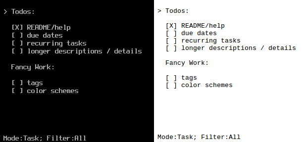

## TaskBox

TaskBox is a hybrid between simple editor and simple task manager for terminal.
It stores data in plain human readable text files (see [TODO.txt](TODO.txt)),
does not use any database backend, and does not require any libs.



## Installation

You will need to have [Go](https://golang.org) installed and configured
in your path.

```
git clone https://github.com/smetana/taskbox-go
cd taskbox-go
go get -d ./
go build -o taskbox
```

## Usage
```
./taskbox <filename>
```
